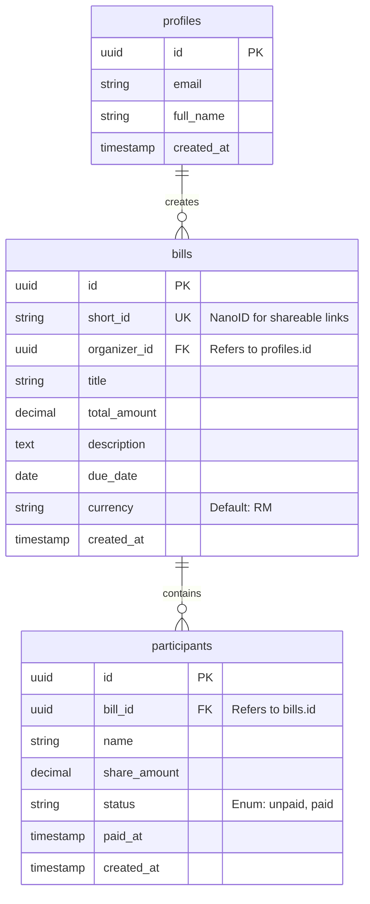

# Data Model: Split Bill & Payment Tracker

This document defines the database schema and entity relationships for the SplitSavvy application.

## Entity-Relationship Diagram (ERD)

## Tables & Fields

### `profiles` (Supabase Auth Users)
Managed by Supabase Auth, but custom profile data stored here.
- `id`: `uuid` (Primary Key, matches `auth.users.id`)
- `email`: `text` (Unique)
- `full_name`: `text`
- `created_at`: `timestamp with time zone` (Default: `now()`)

### `bills`
- `id`: `uuid` (Primary Key, Internal)
- `short_id`: `text` (Unique, Index, for URLs e.g., `xY7z2k9A`)
- `organizer_id`: `uuid` (Foreign Key -> `profiles.id`, NOT NULL)
- `title`: `text` (NOT NULL)
- `total_amount`: `numeric(10, 2)` (NOT NULL)
- `description`: `text` (Optional)
- `due_date`: `date` (NOT NULL)
- `currency`: `text` (Default: 'RM')
- `created_at`: `timestamp with time zone` (Default: `now()`)

### `participants`
- `id`: `uuid` (Primary Key)
- `bill_id`: `uuid` (Foreign Key -> `bills.id`, CASCADE ON DELETE)
- `name`: `text` (NOT NULL)
- `share_amount`: `numeric(10, 2)` (NOT NULL)
- `status`: `text` (Enum: 'unpaid', 'paid', Default: 'unpaid')
- `paid_at`: `timestamp with time zone` (Optional)
- `created_at`: `timestamp with time zone` (Default: `now()`)

## Security Policies (Supabase RLS)

### `bills` table
- **SELECT**: 
    - Organizers can see their own bills (`auth.uid() = organizer_id`).
    - Public can see a bill if they have the correct `short_id` (used for shareable links).
- **INSERT**: Authenticated users only.
- **UPDATE/DELETE**: Only the organizer (`auth.uid() = organizer_id`).

### `participants` table
- **SELECT**:
    - Organizers can see participants of their bills.
    - Public can see participants of a bill if they have the bill's `short_id`.
- **INSERT**: Only the organizer during bill creation.
- **UPDATE**: 
    - Organizers can update any participant.
    - Public can update `status` to 'paid' and set `paid_at` for a specific participant (simulated payment flow).
- **DELETE**: Only the organizer.

## Validation Rules
- `total_amount` must be greater than 0.
- `share_amount` must be greater than or equal to 0.
- `due_date` should ideally be in the future (though not strictly enforced if retroactive).
- `short_id` must be generated server-side using a collision-resistant algorithm (e.g., NanoID).
